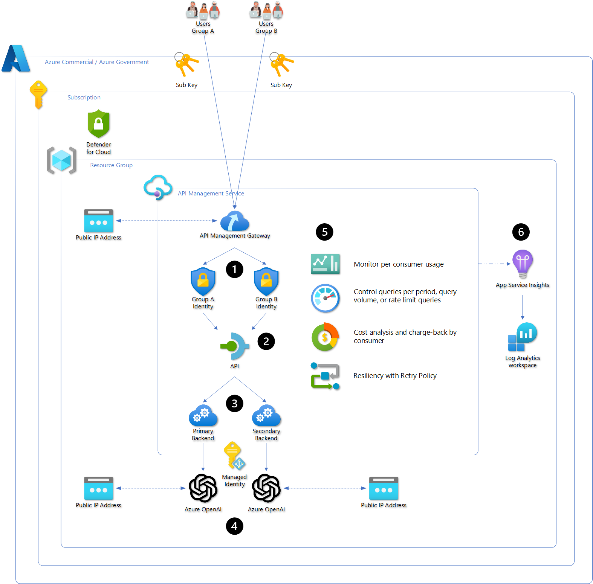
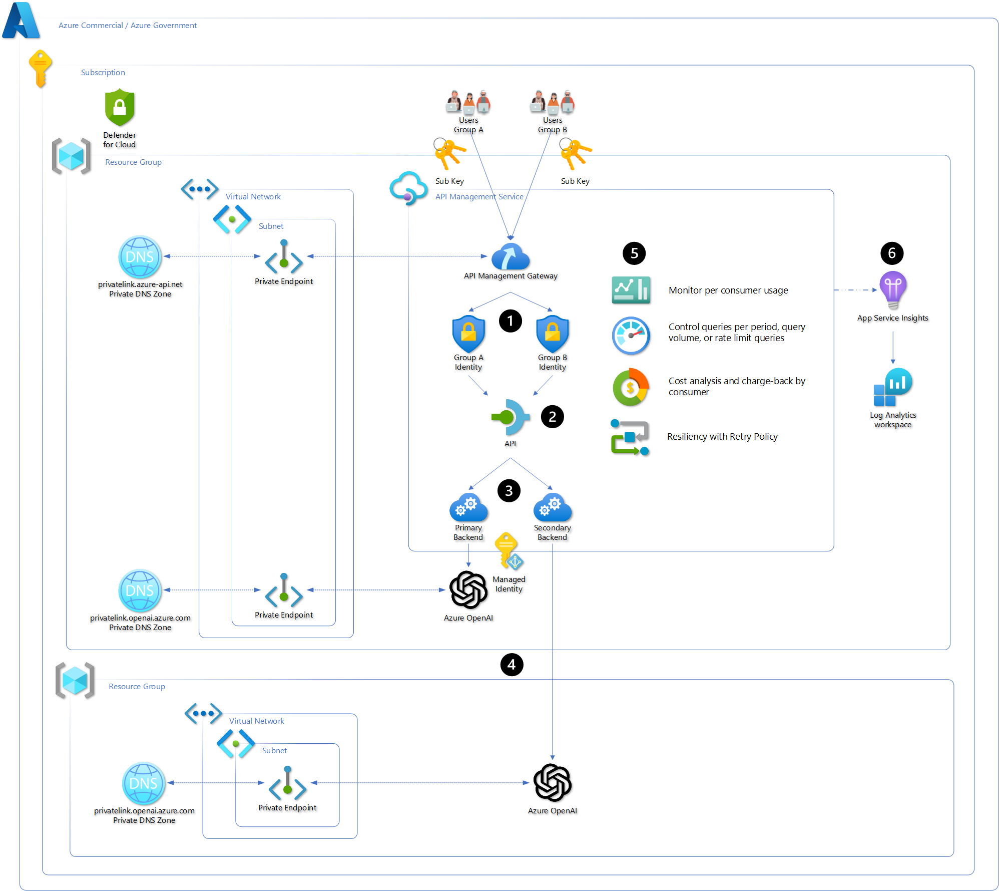
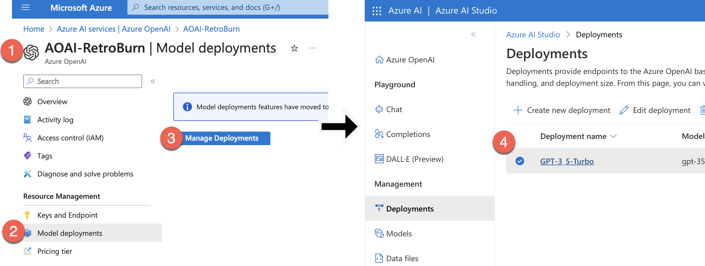

# Manage Azure OpenAI using APIM

## Overview

One-button deploy APIM, Key vault, and Log Analytics. Auto-configure APIM to work with your Azure OpenAI endpoint. 

Using Azure's APIM orchestration provides a organizations with a powerful way to scale and manage their Azure OpenAI service without deploying Azure OpenAI endpoints everywhere. Administrators can issue subscription keys via APIM for accessing a single Azure OpenAI service instead of having teams share Azure OpenAI keys. APIM delivers usage metrics along with API monitoring to improve business intelligence. APIM policies control access, throttling, and a mechanism for chargeback cost models.

Gain conceptual details and technical step-by-step knowledge on implementing APIM to support your Azure OpenAI resiliency, scalability, performance, monitoring, and charge back capabilities. 

> [!IMPORTANT]
>
> The goal with this repo is to provide more than conceptual knowledge on the services and technology. We want you to walk away from this repo knowing EXACTLY what to do to add these capabilities to YOUR enterprise. If we are missing information  or steps or details or visuals or videos or anything that adds friction to you gaining this knowledge effectively and efficiently, please say something - [Add your Ideas · Discussions · GitHub](https://github.com/microsoft/AzureOpenAI-with-APIM/discussions/categories/ideas).

## Solutions

There are two solutions developed to meet the needs of the organization from a sandbox to model a production environment.

> [!NOTE]
>
> With Azure OpenAI's availability in Azure Government, the solutions are consolidated down because they are identical whether deployed into Azure Commercial or Azure Government.

- [API Management to Azure OpenAI](#api-management-to-azure-openai)
- [API Management to Azure OpenAI with private endpoints](#api-management-to-azure-openai-with-private-endpoints)

## Using it

Once the service is deployed, use the following section to understand how to access your Azure OpenAI service via APIM.

- [Steps and examples on how to use your APIM-based API to query your Azure OpenAI API](#tying-it-all-together)

### Utilization per subscription (support Charge-back)

> [!TIP]
>
> A subscription, in the context of APIM, is the authorization of a user or group to access an API.

Calculate token counts per subscription. This can be helpful to monitor utilization of Azure OpenAI but also provides the foundation for a charge-back model if, internally, your organization provides a shared services model where Azure OpenAI is deployed and provided back to the business with one of the following models:

- For free and the team managing the service pays for all costs
- Cost basis so the team managing the service provides access to said service but requires the internal business consumer to pay for its use. 

Use the following link to deploy an APIM policy and supporting services to capture token counts by subscription using an Event hub, process them using an Azure Function, and log them to Log Analytics workspace for reporting.

- [Deploy service to monitor Azure OpenAI token count per subscription](#azure-openai-token-count-per-subscription)

### Resiliency (Retry Policy)

Resiliency is the ability of the service to recover from an issue. With regard to Azure OpenAI and APIM, this means using a Retry Policy to attempt the prompt again. Typically the prompt fails because at the time the user submitted their prompt, the Azure OpenAI endpoint was maxed out of either Tokens Per Minute or Requests Per Minute based on the endpoints quota, which triggers a HTTP 429 error.

- Retry policy to leverage two or more Azure OpenAI endpoints
- Expands capacity without impact to user experience or requesting increase to existing Azure OpenAI endpoints

Single region Retry policy means APIM will wait for a specific period of time and attempt to submit the prompt to the same Azure OpenAI endpoint. This is ok for development phases of solutions but not ideal for production.

Multi region Retry policy means APIM will immediately submit the prompt to a completely separate Azure OpenAI endpoint that is deployed to a separate Azure region. This effectively doubles your Azure OpenAI quota and provides resiliency. You can tie this together with the APIM Load Balancer capability (as of April 4, 2024, this is Azure Commercial only and in Preview) you can have scale and resiliency. This is discussed in more detail [LINK HERE]

- [Implement Resiliency](#resiliency)

### Scalability (Load Balancing)

Scalability provides the ability of your Azure OpenAI service to support higher loads without necessarily increasing regional quotas. This feature  (as of April 4, 2024, this is Azure Commercial only and in Preview) uses two or more Azure OpenAI endpoints in a round-robin load balancing configuration. This feature is not built into the One-button deploy but perspective implementation is provided so that organizations can implement.

You can tie this together with the Retry policy (as of April 4, 2024, this is Azure Commercial only and in Preview) you can have scale and resiliency. This is discussed in more detail [LINK HERE]

- [Implement Scalability](#scalability)

### Performance (Provisioned Throughput Units)

Scale provides ability of an organization to support higher loads by leveraging multiple regions but the TPM cost model is a best effort compute with no SLAs. When using TPM pay as you go model, as long as your Azure OpenAI endpoint has quota - your prompts will be processed but their latency may be higher than anticipated and variability may be more inconsistent than anticipated.

To improve performance, Azure OpenAI has a cost model called Provisioned Throughput Units (PTU). When using PTUs, the organization is procuring an allotted amount of GPU to process their models. No other organization or individual can use that GPU. This has a positive effect of reducing latency and tightening up the variability in latency. It has a secondary effect of improving [cost forecasting](#cost-forecasting-provisioned-throughput-units-+-rate-limiting) (discussed in more detail further in this article). 

- [Implement Performance](#performance)

### Cost Management (Rate Limiting)

- Provide cost management per subscription with Rate Throttling
- [Implement Cost Management](#cost-management)

### Cost Forecasting (Provisioned Throughput Units + Rate Limiting)

- [Implement Cost Forecasting](#cost-forecasting)

### Access Control

#### Managed Identity

**APIM to Azure OpenAI**

> [!IMPORTANT]
>
> The latest update to this repo moves to Managed Identity for the one-button deployments and guides for modifying existing APIM services.

Managed identities is the ideal method for authenticating APIM to Azure OpenAI. This eliminates the need to manage the rotation of keys and for keys to be stored anywhere beyond the Azure OpenAI endpoint. 

- [Implement authenticating APIM to Azure OpenAI using Managed Identity](#apim-to-azure-openai)

**Client or Application to APIM**

Managed identities of the Azure App Service, Virtual Machine, Azure Kubernetes Service, or any other compute service in Azure is the preferred method of authentication. It improves security and eliminates the issuance of keys and tokens. Clients can use an OAuth token if required to validate access when using Azure OpenAI via APIM.

These methods shifts the burden of authentication from the application and onto APIM, which improves performance, scalability, operational management, and identity service selection. Update APIM's identity provider for OAuth and that update flows down to the application without any modification to the application.  

The examples provide both methods along with guidance on how to setup the client or application to run the code so that managed identity technique can be used.

- [Implement authenticating application to APIM using Managed Identity](#application-to-apim)
- [Implement authenticating client to APIM using Entra](#client-to-apim)

#### Tokens and Keys

**APIM to Azure OpenAI SAS Token**

Subscription key is like a SAS token provided by the backend service but it is issued by APIM for use by the user or group. These are fine during the development phase. We've retained the policy xml file in the repo as an example but this technique is not used.

- [Implement authenticating APIM to Azure OpenAI using SAS](#apim-to-azure-openai-sas-token)

**Client or Application to APIM**

For development and when running test commands from your workstation, using the Subscription key is straightforward but we recommend moving from the Subscription key to Managed Identities beyond development. The examples provide both methods along with guidance on how to setup the client or application to run the code so that managed identity technique can be used.

- [Implement authenticating application to APIM using Subscription Key](#application-to-apim-subscription-key)
- [Implement authenticating client to APIM using Subscription Key](#client-to-apim-subscription-key)

## Prerequisites

### Azure 

- Contributor permissions to subscription or resource group
- Resource Group (or ability to create)
- Azure OpenAI service deployed
  - [How-to: Create and deploy an Azure OpenAI Service resource - Azure OpenAI | Microsoft Learn](https://learn.microsoft.com/en-us/azure/ai-services/openai/how-to/create-resource?pivots=web-portal)
  - If using Multi-region, then deploy an additional Azure OpenAI service in a different region.
- Azure OpenAI model deployed
  - [How-to: Create and deploy an Azure OpenAI Service resource - Azure OpenAI | Microsoft Learn](https://learn.microsoft.com/en-us/azure/ai-services/openai/how-to/create-resource?pivots=web-portal#deploy-a-model)
  - If using Multi-region, make sure Deployment names are identical.
- Azure OpenAI service URL
  - [Quickstart - Deploy a model and generate text using Azure OpenAI Service - Azure OpenAI | Microsoft Learn](https://learn.microsoft.com/en-us/azure/ai-services/openai/quickstart?tabs=command-line&pivots=rest-api#retrieve-key-and-endpoint)
  - If using Multi-region, collect the additional Azure OpenAI service URL.


### One-Button

Each solution provides a simple one-button deployment. Select the "Deploy to Azure" button which will open the Azure portal and provide a form for details.

### Command Line

To use the command line deployment method, fork the library and use Codespaces or clone the forked library to your local computer.

- [GitHub Codespaces](https://github.com/features/codespaces)

#### Azure CLI

- [How to install the Azure CLI | Microsoft Learn](https://learn.microsoft.com/en-us/cli/azure/install-azure-cli)
- [Connect to Azure Government with Azure CLI - Azure Government | Microsoft Learn](https://learn.microsoft.com/en-us/azure/azure-government/documentation-government-get-started-connect-with-cli)

#### Azure PowerShell

- [How to install Azure PowerShell | Microsoft Learn](https://learn.microsoft.com/en-us/powershell/azure/install-azure-powershell?view=azps-10.2.0)
- [Connect to Azure Government with PowerShell - Azure Government | Microsoft Learn](https://learn.microsoft.com/en-us/azure/azure-government/documentation-government-get-started-connect-with-ps)

## Architectures

The following architectural solutions support two use-cases in the Azure Commercial and Azure Government environments. Determining which solution to implement requires understanding of your current utilization of Azure. 

- [API Management to Azure OpenAI](#api-management-to-azure-open-ai)
  - Supports Azure Commercial and Azure Government
  - Developing proof of concept or minimum viable production solution.
  - *Isolated from enterprise networking* using internal networks, Express Routes, and site-2-site VPN connections from the cloud to on-premises networks.
  - Assigns APIM the 
- [API Management to Azure OpenAI with private endpoints](#api-management-to-azure-open-ai-with-private-endpoints)
  - Supports Azure Commercial and Azure Government
  - Pilot or production solution.
  - *Connected to the enterprise networking* using internal networks, Express Routes, and site-2-site VPN connections from the cloud to on-premises networks.


### API Management to Azure OpenAI

Use API management deployed to your Azure environment using public IP addresses for accessing APIM and for APIM to access the Azure OpenAI API. Access to the services is secured using keys and Defender for Cloud. 

> [!NOTE]
>
> Only API Management Service is deployed, this solution requires the Azure OpenAI service to already exist.



1. Users and Groups are used to assign access to an API using subscriptions.
   1. Each User or Group can be assigned their own policies like rate-limiting to control use
2. The Azure OpenAI API uses policies to assign backends, retry, rate-throttling, and token counts.
3. The backends are assigned using a policy and can include load balance groups. Retry policies reference additional backends for resiliency.
4. One or more Azure OpenAI service (endpoint) can be used to manage scale and resiliency.
   1. The endpoints will reside in different regions so that they can utilize the maximum quota available to them.
5. Policies are used to collect information, perform actions, and manipulate user connections.
6. App Insights are used to create dashboards to monitor performance and use.

#### Deploy

**! NOTE !** - It can take up to 45 minutes for all services to deploy as API Management has many underlying Azure resources deployed running the service.

##### One Button

Simple one-button deployment, opens in Azure Portal

[](https://portal.azure.com/#create/Microsoft.Template/uri/https%3A%2F%2Fraw.githubusercontent.com%2Fmicrosoft%2FAzureOpenAI-with-APIM%2Fmain%2Fpublic-apim.json)

[](https://portal.azure.us/#create/Microsoft.Template/uri/https%3A%2F%2Fraw.githubusercontent.com%2Fmicrosoft%2FAzureOpenAI-with-APIM%2Fmain%2Fpublic-apim.json)

##### Azure CLI

```powershell
# Update the following variables to use the appropriate resource group and subscription.
$resourceGroupName = "RG-APIM-OpenAI"
$location = "East US" # Use MAG region when deploying to MAG
$subscriptionName = "MySubscription"

# az cloud set --name AzureUSGovernment # Uncomment when deploying to MAG
az login
az account set --subscription $subscriptionName
az group create --name $resourceGroupName --location $location
az deployment group create --resource-group $resourceGroupName  --template-file .\public-apim.bicep --mode Incremental
```

##### Azure PowerShell

```powershell
# Update the following variables to use the appropriate resource group and subscription.
$resourceGroupName = "RG-APIM-OpenAI"
$location = "East US" # Use MAG region when deploying to MAG
$subscriptionName = "MySubscription"

Connect-AzAccount #-Environment AzureUSGovernment # Uncomment when deploying to MAG
Set-AzContext -Subscription $subscriptionName
New-AzResourceGroup -Name $resourceGroupName -Location $location
New-AzResourceGroupDeployment -ResourceGroupName $resourceGroupName -TemplateFile .\public-apim.bicep -Verbose -mode Incremental
```

#### Next steps

- Now that APIM is deployed and automatically configured to work with your Azure OpenAI service
  - [Click here to learn how do you use the APIM endpoint to interact with Azure OpenAI?](#tying-it-all-together)

### API Management to Azure OpenAI with private endpoints

Use API management deployed to your Azure environment using private IP addresses for accessing APIM and for APIM to access the Azure OpenAI API. Access to the services is secured using private network connectivity, keys, and Defender for Cloud. Access to the private network is controlled by customer infrastructure and supports internal routing via Express Route or site-2-site VPN for broader enterprise network access like on-premises data centers or site-based users.



1. Users and Groups are used to assign access to an API using subscriptions.
   1. Each User or Group can be assigned their own policies like rate-limiting to control use
2. The Azure OpenAI API uses policies to assign backends, retry, rate-throttling, and token counts.
3. The backends are assigned using a policy and can include load balance groups. Retry policies reference additional backends for resiliency.
4. One or more Azure OpenAI service (endpoint) can be used to manage scale and resiliency. 
   1. The endpoints will reside in different regions so that they can utilize the maximum quota available to them.
5. Policies are used to collect information, perform actions, and manipulate user connections.
6. App Insights are used to create dashboards to monitor performance and use.

#### Deploy

**! NOTE !** - It can take up to 45 minutes for all services to deploy as API Management has many underlying Azure resources deployed running the service.

##### One Button

Simple one-button deployment, opens in Azure Portal

[](https://portal.azure.com/#create/Microsoft.Template/uri/https%3A%2F%2Fraw.githubusercontent.com%2Fmicrosoft%2FAzureOpenAI-with-APIM%2Fmain%2Fprivate-apim.json)

[](https://portal.azure.us/#create/Microsoft.Template/uri/https%3A%2F%2Fraw.githubusercontent.com%2Fmicrosoft%2FAzureOpenAI-with-APIM%2Fmain%2Fprivate-apim.json)

##### Azure CLI

```powershell
# Update the following variables to use the appropriate resource group and subscription.
$resourceGroupName = "RG-APIM-OpenAI"
$location = "East US" # Use MAG region when deploying to MAG
$subscriptionName = "MySubscription"

# az cloud set --name AzureUSGovernment # Uncomment when deploying to MAG
az login
az account set --subscription $subscriptionName
az group create --name $resourceGroupName --location $location
az deployment group create --resource-group $resourceGroupName  --template-file .\private-apim.bicep --mode Incremental
```

##### Azure PowerShell

```powershell
# Update the following variables to use the appropriate resource group and subscription.
$resourceGroupName = "RG-APIM-OpenAI"
$location = "East US" # Use MAG region when deploying to MAG
$subscriptionName = "MySubscription"

Connect-AzAccount #-Environment AzureUSGovernment # Uncomment when deploying to MAG
Set-AzContext -Subscription $subscriptionName
New-AzResourceGroup -Name $resourceGroupName -Location $location
New-AzResourceGroupDeployment -ResourceGroupName $resourceGroupName -TemplateFile .\private-apim.bicep -Verbose -mode Incremental
```

#### Next steps

- Now that APIM is deployed and automatically configured to work with your Azure OpenAI service
  - [Click here to learn how do you use the APIM endpoint to interact with Azure OpenAI?](#tying-it-all-together)

## Azure OpenAI token count per subscription

TBD

Policy for collecting tokens and user id

### Log Analytics workspace

TBD

### Event Hub

TBD

### PowerApps Dashboard

TBD

#### Demo

TBD

## Resiliency

#### Retry Policy

TBD

[Azure API Management policy reference - retry | Microsoft Learn](https://learn.microsoft.com/en-us/azure/api-management/retry-policy)

#### Multi-region

TBD

[Ensure reliability of your Azure API Management instance - Azure API Management | Microsoft Learn](https://learn.microsoft.com/en-us/azure/api-management/high-availability)Throttling

TBD

[Advanced request throttling with Azure API Management | Microsoft Learn](https://learn.microsoft.com/en-us/azure/api-management/api-management-sample-flexible-throttling)

## Scalability

- Preview feature for two or more Azure OpenAI endpoints using round-robin load balancing
- Pair with Resiliency for highly scalable solution

## Performance

- Preview feature for two or more Azure OpenAI endpoints using round-robin load balancing
- Pair with Resiliency for highly scalable solution

## Cost Management

- Provide cost management per subscription

## Cost Forecasting

- Provide cost management per subscription

## Access Control

TBD

### Managed Identity

#### APIM to Azure OpenAI

TBD

#### Application to APIM

TBD

#### Client to APIM

TBD

### Tokens and Keys

#### APIM to Azure OpenAI (SAS Token)

TBD

#### Application to APIM (Subscription Key)

TBD

#### Client to APIM (Subscription Key)

TBD

## Tying it All together

Read through the following steps to setup interacting with APIM and how to use consoles or .net to programatically interact with Azure OpenAI via APIM.

### Get your Azure OpenAI Model Name

To determine if you have one or more models deployed, visit the AI Studio. Here you can determine if you need to create a model or use an existing model. You will use the model name when quering the Azure OpenAI API via your APIM.



1. Navigate to your Azure OpenAI resource in Azure
2. Select **Model deployments**
3. Select **Manage Deployments**

4. Review your models and copy the **Deployment name** of the model you want to use

### Get your APIM Subscription Key

The subscription key for APIM is collected at the Subscription section of the APIM resource, regardless if you are in Azure Commercial or Government.

You can use this key for testing or as an example on how to create subscriptions to provide access to you Azure OpenAI service. Instead of sharing your Azure OpenAI Key, you create subscriptions in APIM and share this key, then you can analyze and monitor usage, provide guardrails for usage, and manage access.


1. Navigate to your new APIM
2. Select **Subscriptions** from the menu
3. Select **...**
4. Select **Show/Hide keys**
5. Select **copy icon**

### Get your APIM Azure OpenAI URL

The URL for APIM is collected at the Overview section of the APIM resource, regardless if you are in Azure Commercial or Government.


### Query Examples

Using your Azure OpenAI model, API version, APIM URL, and APIM subscription key you can now execute Azure OpenAI queries against your APIM URL instead of your Azure OpenAI URL. This means you can create new subscription keys for anyone or any team who needs access to Azure OpenAI instead of deploying new Azure OpenAI services.

#### curl

##### PowerShell 7

Copy and paste this script into a text editor or Visual Studio code (VSC).

Modify by including your values, then copy and paste all of it into PowerShell 7 terminal or run from VSC.

- [Link to example.ps1 file in the repo](https://github.com/microsoft/AzureOpenAI-with-APIM/blob/main/example_code/example.ps1)

> [!NOTE]
>
> Modify the "CONTENT" line for the system role and the user role to support your development and testing.

```powershell
# Update these values to match your environment
$apimUrl = 'THE_HTTPS_URL_OF_YOUR_APIM_INSTANCE'
$deploymentName = 'DEPLOYMENT_NAME'
$apiVersion = '2024-02-15-preview'
$subscriptionKey = 'YOUR_APIM_SUBSCRIPTION_KEY'

# Construct the URL
$url = "$apimUrl/deployments/$deploymentName/chat/completions?api-version=$apiVersion"

# Headers
$headers = @{
    "Content-Type" = "application/json"
    "Ocp-Apim-Subscription-Key" = $subscriptionKey
}

# JSON Body
$body = @{
    messages = @(
        @{
            role = "system"
            content = "You are an AI assistant that helps people find information."
        },
        @{
            role = "user"
            content = "What are the differences between Azure Machine Learning and Azure AI services?"
        }
    )
    temperature = 0.7
    top_p = 0.95
    max_tokens = 800
} | ConvertTo-Json

# Invoke the API
$response = Invoke-RestMethod -Uri $url -Method Post -Headers $headers -Body $body

# Output the response
$response.choices.message.content
```

##### Bash

Copy and paste this script into a text editor or Visual Studio code.

Modify by including your values, then copy and paste all of it into bash terminal, run from VSC, or create a ".sh" file to run.

- [Link  to example.sh file in the repo](https://github.com/microsoft/AzureOpenAI-with-APIM/blob/main/example_code/example.sh)

> [!NOTE]
>
> Modify the "CONTENT" line for the system role and the user role to support your development and testing.


```bash
#!/bin/bash
apimUrl="THE_HTTPS_URL_OF_YOUR_APIM_INSTANCE"
deploymentName="DEPLOYHMENT_NAME" # Probaby what you named your model, but change if necessary
apiVersion="2024-02-15-preview" # Change to use the latest version
subscriptionKey="YOUR_APIM_SUBSCRIPTION_KEY"

url="${apimUrl}/deployments/${deploymentName}/chat/completions?api-version=${apiVersion}"
key="Ocp-Apim-Subscription-Key: ${subscriptionKey}"

# JSON payload
jsonPayload='{
    "messages": [
        {
            "role": "system",
            "content": "You are an AI assistant that helps people find information."
        },
        {
            "role": "user",
            "content": "What are the differences between Azure Machine Learning and Azure AI services?"
        }
    ],
    "temperature": 0.7,
    "top_p": 0.95,
    "max_tokens": 800
}'

curl "${url}" -H "Content-Type: application/json" -H "${key}" -d "${jsonPayload}"

```

#### .net

You will most likely be using Visual Studio 202x to run this and you know what you are doing.

> [!NOTE]
>
> Modify the "ChatMessage" lines for the system role and the user role to support your development and testing.

```c#
// Note: The Azure OpenAI client library for .NET is in preview.
// Install the .NET library via NuGet: dotnet add package Azure.AI.OpenAI --version 1.0.0-beta.5 
using Azure;
using Azure.AI.OpenAI;

OpenAIClient client = new OpenAIClient(
	new Uri("https://INSERT_APIM_URL_HERE/deployments/INSERT_DEPLOYMENT_NAME_HERE/chat/completions?api-version=INSERT_API_VERSION_HERE"),
	new AzureKeyCredential("INSERT_APIM_SUBSCRIPTION_KEY_HERE"));

// ### If streaming is not selected
Response<ChatCompletions> responseWithoutStream = await client.GetChatCompletionsAsync(
	"INSERT_MODEL_NAME_HERE",
	new ChatCompletionsOptions()
	{
		Messages =
		{
			new ChatMessage(ChatRole.System, @"You are an AI assistant that helps people find information."),
			new ChatMessage(ChatRole.User, @"What are the differences between Azure Machine Learning and Azure AI services?"),
		},
		Temperature = (float)0,
		MaxTokens = 800,
		NucleusSamplingFactor = (float)1,
		FrequencyPenalty = 0,
		PresencePenalty = 0,
	});

// The following code shows how to get to the content from Azure OpenAI's response
ChatCompletions completions = responseWithoutStream.Value; 
ChatChoice choice = completions.Choices[0];
Console.WriteLine(choice.Message.Content);
```

#### Python

Copy and paste this script into a text editor or Visual Studio code.

Modify by including your values, then copy and paste all of it into bash terminal, run from VSC, or create a ".py" file to run.

- [Link  to example.py file in the repo](https://github.com/microsoft/AzureOpenAI-with-APIM/blob/main/example_code/example.py)

> [!NOTE]
>
> If you are running Juypter notebooks, this provides an example on using Azure OpenAI via APIM

```python
# This code is an example of how to use the OpenAI API with Azure API Management (APIM) in a Jupyter Notebook.
import requests
import json

# Set the parameters
apim_url = "apim_url"
deployment_name = "deployment_name"
api_version = "2024-02-15-preview"
subscription_key = "subscription_key"

# Construct the URL and headers
url = f"{apim_url}/deployments/{deployment_name}/chat/completions?api-version={api_version}"
headers = {
    "Content-Type": "application/json",
    "Ocp-Apim-Subscription-Key": subscription_key
}

# Define the JSON payload
json_payload = {
    "messages": [
        {
            "role": "system",
            "content": "You are an AI assistant that helps people find information."
        },
        {
            "role": "user",
            "content": "What are the differences between Azure Machine Learning and Azure AI services?"
        }
    ],
    "temperature": 0.7,
    "top_p": 0.95,
    "max_tokens": 800
}

# Make the POST request
response = requests.post(url, headers=headers, json=json_payload)

# Print the response text (or you can process it further as needed)
print(response.text)
```

## References

- [Calculating Chargebacks for Business Units/Projects Utilizing a Shared Azure OpenAI Instance - Microsoft Community Hub](https://techcommunity.microsoft.com/t5/apps-on-azure-blog/calculating-chargebacks-for-business-units-projects-utilizing-a/ba-p/3909202)
