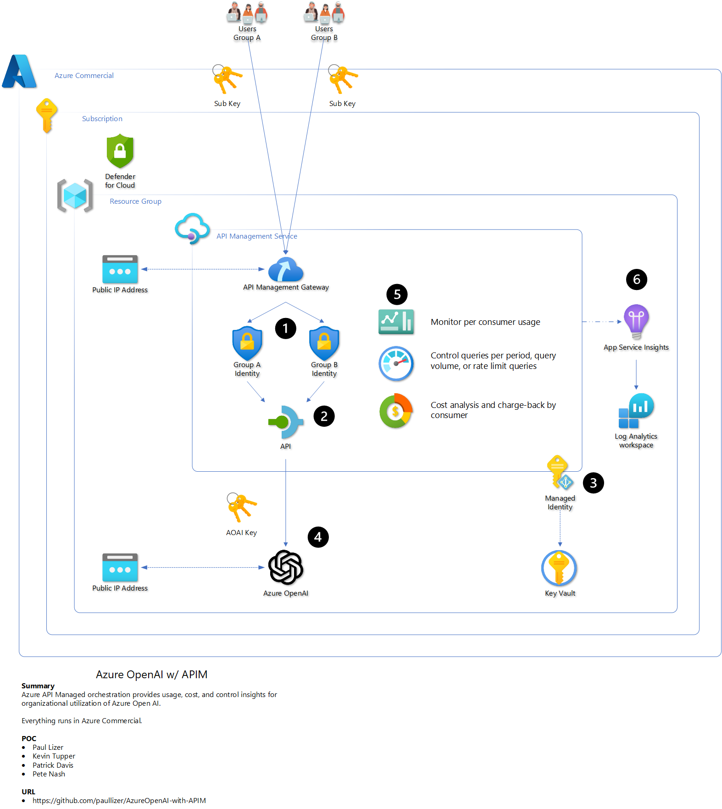
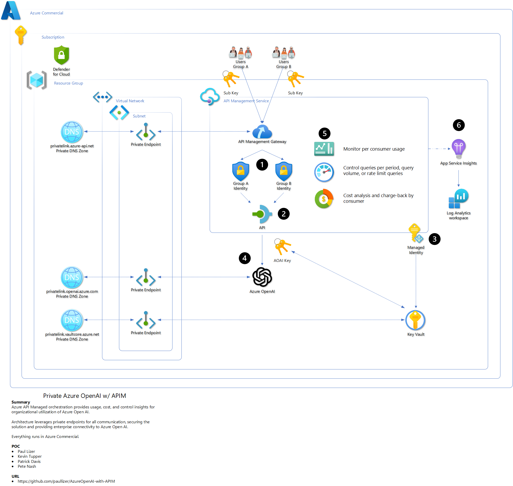
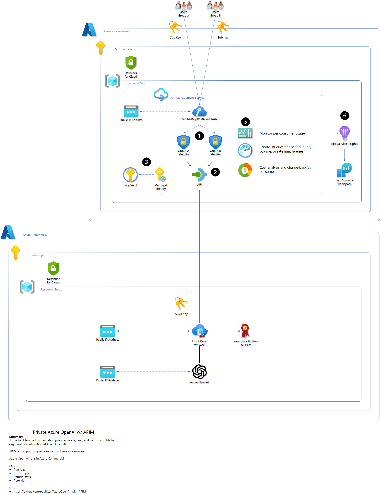
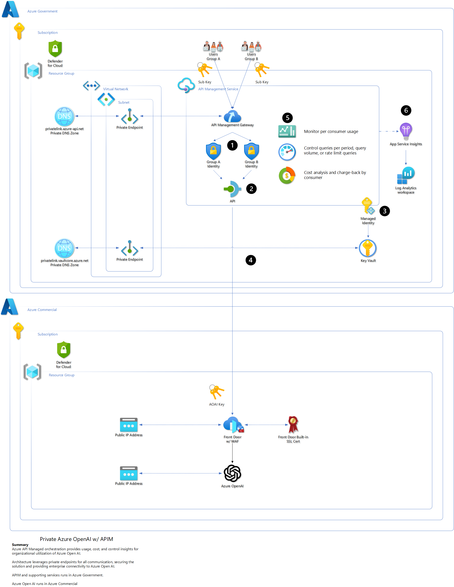
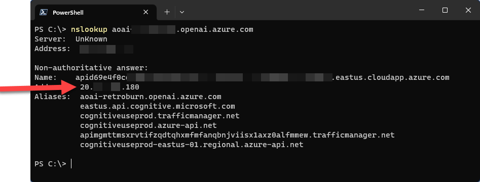
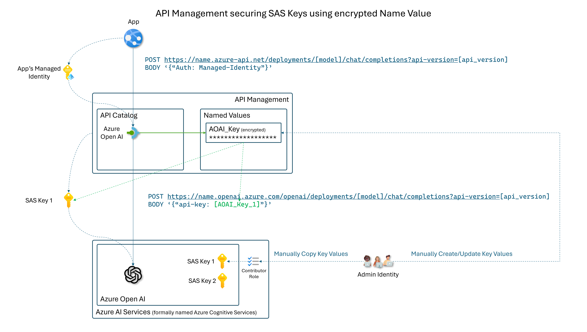
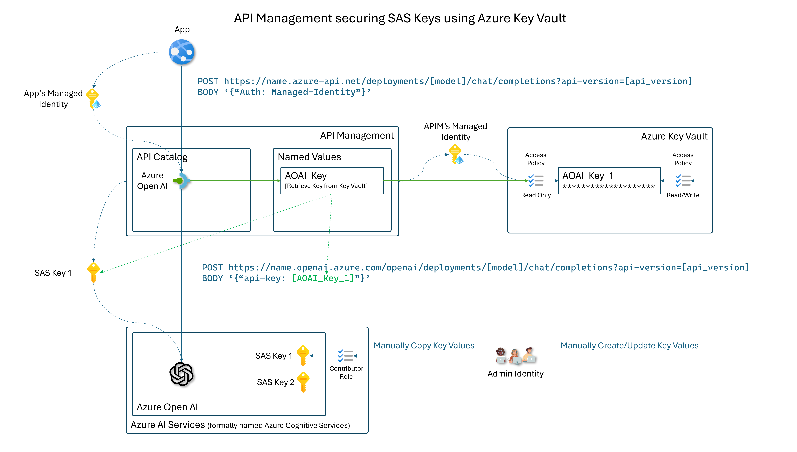

# Manage Azure OpenAI using APIM

## Overview

One-button deploy APIM, Keyvault, and Log Ananlytics. Auto-configure APIM to work with your Azure OpenAI endpoint. 

Using Azure's APIM orchestration provides a organizations with a powerful way to scale and manage their Azure OpenAI service without deploying Azure OpenAI endpoints everywhere. Administrators can issue subscription keys via APIM for accessing a single Azure OpenAI service instead of having teams share Azure OpenAI keys. APIM delivers usage metrics along with API monitoring to improve business intelligence. APIM policies control access, throttling, and a mechanism for chargeback cost models.

## Solutions

There are four solutions developed to meet the needs of the organization from a sandbox to model a production environment. 

- [Azure Commercial API Management to Azure OpenAI](#azure-commercial-api-management-to-azure-openai)
- [Azure Commercial API Management to Azure OpenAI with private endpoints](#azure-commercial-api-management-to-azure-openai-with-private-endpoints)
- [Azure Government API Management to Azure OpenAI](#azure-government-api-management-to-azure-openai)
- [Azure Government API Management to Azure OpenAI with private endpoints](#azure-government-api-management-to-azure-openai-with-private-endpoints)

## Using it

Once the service is deployed, use the following section to understand how to access your Azure OpenAI service via APIM.

- [Steps and examples on how to use your APIM-based API to query your Azure OpenAI API](#tying-it-all-together)

### Utilization per subscription

- Chargeback

link to further in doc

### Resiliency

- Retry policy to leverage two or more Azure OpenAI endpoints
- Expands capacity without impact to user experience or requesting increase to existing Azure OpenAI endpoints

TBD

link to further in doc

### Rate throttling

- Provide cost management per subscription

link to further in doc

### Load Balancer

- Preview feature for two or more Azure OpenAI endpoints using round-robin load balancing
- Pair with Resiliency for highly scalable solution

link to further in doc

### Access Control

- Managed Identity
- Subscription Key (aka SAS Key)

link to further in doc

## Prerequisites

### Azure 

- Contributor permissions to subscription or resource group
- Resource Group (or ability to create)
- Azure OpenAI service deployed
  - [How-to: Create and deploy an Azure OpenAI Service resource - Azure OpenAI | Microsoft Learn](https://learn.microsoft.com/en-us/azure/ai-services/openai/how-to/create-resource?pivots=web-portal)

- Azure OpenAI model deployed
  - [How-to: Create and deploy an Azure OpenAI Service resource - Azure OpenAI | Microsoft Learn](https://learn.microsoft.com/en-us/azure/ai-services/openai/how-to/create-resource?pivots=web-portal#deploy-a-model)

- Azure OpenAI service URL
  - [Quickstart - Deploy a model and generate text using Azure OpenAI Service - Azure OpenAI | Microsoft Learn](https://learn.microsoft.com/en-us/azure/ai-services/openai/quickstart?tabs=command-line&pivots=rest-api#retrieve-key-and-endpoint)

- Azure OpenAI key
  - [Quickstart - Deploy a model and generate text using Azure OpenAI Service - Azure OpenAI | Microsoft Learn](https://learn.microsoft.com/en-us/azure/ai-services/openai/quickstart?tabs=command-line&pivots=rest-api#retrieve-key-and-endpoint)

- Azure OpenAI service public IP
  - ***Azure Government w/ Private Endpoint Deploy Solution Only*** 
  - [How-to: Get the public IP address of Azure OpenAI service](#get-public-ip-address-of-my-azure-open-ai-service)


### One-Button

Each solution provides a simple one-button deployment. Select the "Deploy to Azure" button which will open the Azure portal and provide a form for details.

### Command Line

To use the command line deployment method, fork the library and use Codespaces or clone the forked library to your local computer.

- [GitHub Codespaces](https://github.com/features/codespaces)

#### Azure CLI

- [How to install the Azure CLI | Microsoft Learn](https://learn.microsoft.com/en-us/cli/azure/install-azure-cli)
- [Connect to Azure Government with Azure CLI - Azure Government | Microsoft Learn](https://learn.microsoft.com/en-us/azure/azure-government/documentation-government-get-started-connect-with-cli)

#### Azure PowerShell

- [How to install Azure PowerShell | Microsoft Learn](https://learn.microsoft.com/en-us/powershell/azure/install-azure-powershell?view=azps-10.2.0)
- [Connect to Azure Government with PowerShell - Azure Government | Microsoft Learn](https://learn.microsoft.com/en-us/azure/azure-government/documentation-government-get-started-connect-with-ps)

## Architectures

The following architectural solutions support two use-cases in the Azure Commercial and Azure Government environments. Determining which solution to implement requires understanding of your current utilization of Azure. 

- [Azure Commercial API Management to Azure OpenAI](#azure-commercial-api-management-to-azure-open-ai)
  - *Azure Commercial is primary* cloud environment used by the team or organization.
  - Developing proof of concept or minimum viable production solution.
  - *Isolated from enterprise networking* using internal networks, Express Routes, and site-2-site VPN connections from the cloud to on-premesis networks.

- [Azure Commercial API Management to Azure OpenAI with private endpoints](#azure-commercial-api-management-to-azure-open-ai-with-private-endpoints)
  - *Azure Commerical is primary* cloud environment used by the team or organization
  - Pilot or production solution.
  - *Connected to the enterprise networking* using internal networks, Express Routes, and site-2-site VPN connections from the cloud to on-premesis networks.

- [Azure Government API Management to Azure OpenAI](#azure-government-api-management-to-azure-open-ai)
  - *Azure Government is primary* cloud environment used by the team or organization.
  - Developing proof of concept or minimum viable production solution.
  - *Isolated from enterprise networking* using internal networks, Express Routes, and site-2-site VPN connections from the cloud to on-premesis networks.

- [Azure Government API Management to Azure OpenAI with private endpoints](#azure-government-api-management-to-azure-open-ai-with-private-endpoints)
  - *Azure Government is primary* cloud environment used by the team or organization
  - Pilot or production solution.
  - *Connected to the enterprise networking* using internal networks, Express Routes, and site-2-site VPN connections from the cloud to on-premesis networks.


### Azure Commercial API Management to Azure OpenAI

Use API management deployed to the Azure Commercial cloud using public IP addresses for accessing APIM and for APIM to access the Azure OpenAI API. Access to the services is secured using keys and Defender for Cloud. 



#### Deploy

**! NOTE !** - It can take up to 45 minutes for all services to deploy as API Management has many underlying Azure resources deployed running the service.

##### One Button

Simple one-button deployment, opens in Azure Portal

[](https://portal.azure.com/#create/Microsoft.Template/uri/https%3A%2F%2Fraw.githubusercontent.com%2Fmicrosoft%2FAzureOpenAI-with-APIM%2Fmain%2Fpublic-apim.json)

##### Azure CLI

```powershell
# Update the following variables to use the appropriate resource group and subscription.
$resourceGroupName = "RG-APIM-OpenAI"
$location = "East US"
$subscriptionName = "MySubscription"

az login
az account set --subscription $subscriptionName
az group create --name $resourceGroupName --location $location
az deployment group create --resource-group $resourceGroupName  --template-file .\public-apim.bicep --mode Incremental
```

##### Azure PowerShell

```powershell
# Update the following variables to use the appropriate resource group and subscription.
$resourceGroupName = "RG-APIM-OpenAI"
$location = "East US"
$subscriptionName = "MySubscription"

Connect-AzAccount
Set-AzContext -Subscription $subscriptionName
New-AzResourceGroup -Name $resourceGroupName -Location $location
New-AzResourceGroupDeployment -ResourceGroupName $resourceGroupName -TemplateFile .\public-apim.bicep -Verbose -mode Incremental
```

#### Next steps

- Now that APIM is deployed and automatically configured to work with your Azure OpenAI service
  - [Click here to learn how do you use the APIM endpoint to interact with Azure OpenAI?](#tying-it-all-together)

### Azure Commercial API Management to Azure OpenAI with private endpoints

Use API management deployed to the Azure Commercial cloud using private IP addresses for accessing APIM and for APIM to access the Azure OpenAI API. Access to the services is secured using private network connectivity, keys and Defender for Cloud. Access to the private network is controlled by customer infrastructure and supports internal routing via Express Route or site-2-site VPN for broader enterprise network access like on-premises data centers or site-based users.



#### Deploy

**! NOTE !** - It can take up to 45 minutes for all services to deploy as API Management has many underlying Azure resources deployed running the service.

##### One Button

Simple one-button deployment, opens in Azure Portal

[](https://portal.azure.com/#create/Microsoft.Template/uri/https%3A%2F%2Fraw.githubusercontent.com%2Fmicrosoft%2FAzureOpenAI-with-APIM%2Fmain%2Fprivate-apim.json)

##### Azure CLI

```powershell
# Update the following variables to use the appropriate resource group and subscription.
$resourceGroupName = "RG-APIM-OpenAI"
$location = "East US"
$subscriptionName = "MySubscription"

az login
az account set --subscription $subscriptionName
az group create --name $resourceGroupName --location $location
az deployment group create --resource-group $resourceGroupName  --template-file .\private-apim.bicep --mode Incremental
```

##### Azure PowerShell

```powershell
# Update the following variables to use the appropriate resource group and subscription.
$resourceGroupName = "RG-APIM-OpenAI"
$location = "East US"
$subscriptionName = "MySubscription"

Connect-AzAccount
Set-AzContext -Subscription $subscriptionName
New-AzResourceGroup -Name $resourceGroupName -Location $location
New-AzResourceGroupDeployment -ResourceGroupName $resourceGroupName -TemplateFile .\private-apim.bicep -Verbose -mode Incremental
```

#### Next steps

- Now that APIM is deployed and automatically configured to work with your Azure OpenAI service
  - [Click here to learn how do you use the APIM endpoint to interact with Azure OpenAI?](#tying-it-all-together)

### Azure Government API Management to Azure OpenAI

Use API management deployed to the Azure Government cloud using public IP addresses for accessing APIM and for APIM to access the Azure Commercial-based Azure OpenAI API. Access to the services is secured using keys and Defender for Cloud. 

Network routing from the APIM to the Azure OpenAI address uses Microsoft's backbone, eliminating public routing.



#### Deploy

**! NOTE !** - It can take up to 45 minutes for all services to deploy as API Management has many underlying Azure resources deployed running the service.

##### One Button

Simple one-button deployment, opens in Azure Portal

[](https://portal.azure.us/#create/Microsoft.Template/uri/https%3A%2F%2Fraw.githubusercontent.com%2Fmicrosoft%2FAzureOpenAI-with-APIM%2Fmain%2Fpublic-apim.json)

##### Azure CLI

```powershell
# Update the following variables to use the appropriate resource group and subscription.
$resourceGroupName = "RG-APIM-OpenAI"
$location = "usgovvirginia"
$subscriptionName = "MySubscription"

az cloud set --name AzureUSGovernment
az login
az account set --subscription $subscriptionName
az group create --name $resourceGroupName --location $location
az deployment group create --resource-group $resourceGroupName  --template-file .\public-apim.bicep --mode Incremental
```

##### Azure PowerShell

```powershell
# Update the following variables to use the appropriate resource group and subscription.
$resourceGroupName = "RG-APIM-OpenAI"
$location = "East US"
$subscriptionName = "MySubscription"

Connect-AzAccount -Environment AzureUSGovernment
Set-AzContext -Subscription $subscriptionName
New-AzResourceGroup -Name $resourceGroupName -Location $location
New-AzResourceGroupDeployment -ResourceGroupName $resourceGroupName -TemplateFile .\public-apim.bicep -Verbose -mode Incremental
```

#### Next steps

- Now that APIM is deployed and automatically configured to work with your Azure OpenAI service
  - [Click here to learn how do you use the APIM endpoint to interact with Azure OpenAI?](#tying-it-all-together)

### Azure Government API Management to Azure OpenAI with private endpoints

Use API management deployed to the Azure Government cloud using private IP addresses for accessing APIM and for APIM to access the Azure Commercial-based Azure OpenAI API.  

Access to the services is secured using private network connectivity, keys and Defender for Cloud. Access to the private network is controlled by customer infrastructure and supports internal routing via Express Route or site-2-site VPN for broader enterprise network access like on-premises data centers or site-based users.

Network routing from the APIM to the Azure OpenAI address uses Microsoft's backbone, eliminating public routing. 



#### Deploy

**! NOTE !** - It can take up to 45 minutes for all services to deploy as API Management has many underlying Azure resources deployed running the service.

##### One Button

Simple one-button deployment, opens in Azure Portal

[](https://portal.azure.us/#create/Microsoft.Template/uri/https%3A%2F%2Fraw.githubusercontent.com%2Fmicrosoft%2FAzureOpenAI-with-APIM%2Fmain%2Fprivate-apim-azure_government.json)

##### Azure CLI

```powershell
# Update the following variables to use the appropriate resource group and subscription.
$resourceGroupName = "RG-APIM-OpenAI"
$location = "usgovvirginia"
$subscriptionName = "MySubscription"

az cloud set --name AzureUSGovernment
az login
az account set --subscription $subscriptionName
az group create --name $resourceGroupName --location $location
az deployment group create --resource-group $resourceGroupName  --template-file .\private-apim-azure_government.bicep --mode Incremental
```

##### Azure PowerShell

```powershell
# Update the following variables to use the appropriate resource group and subscription.
$resourceGroupName = "RG-APIM-OpenAI"
$location = "East US"
$subscriptionName = "MySubscription"

Connect-AzAccount -Environment AzureUSGovernment
Set-AzContext -Subscription $subscriptionName
New-AzResourceGroup -Name $resourceGroupName -Location $location
New-AzResourceGroupDeployment -ResourceGroupName $resourceGroupName -TemplateFile .\private-apim-azure_government.bicep -Verbose -mode Incremental
```

#### Next steps

- Now that APIM is deployed and automatically configured to work with your Azure OpenAI service
  - [Click here to learn how do you use the APIM endpoint to interact with Azure OpenAI?](#tying-it-all-together)

## Utilization per subscription

TBD

Policy for collecting tokens and user id

### Log Analytics workspace

TBD

### Event Hub

TBD

### PowerApps Dashboard

TBD

#### Demo

TBD

## Resiliency

#### Retry Policy

TBD

[Azure API Management policy reference - retry | Microsoft Learn](https://learn.microsoft.com/en-us/azure/api-management/retry-policy)

#### Multi-region

TBD

[Ensure reliability of your Azure API Management instance - Azure API Management | Microsoft Learn](https://learn.microsoft.com/en-us/azure/api-management/high-availability)Throttling

TBD

[Advanced request throttling with Azure API Management | Microsoft Learn](https://learn.microsoft.com/en-us/azure/api-management/api-management-sample-flexible-throttling)

## Rate throttling

- Provide cost management per subscription

## Load Balancer

- Preview feature for two or more Azure OpenAI endpoints using round-robin load balancing
- Pair with Resiliency for highly scalable solution

## Access Control

TBD

### Subscription Keys

TBD

### Managed Identity

TBD

## Tying it All together

Read through the following steps to setup interacting with APIM and how to use consoles or .net to programatically interact with Azure OpenAI via APIM.

### Get your Azure OpenAI Model Name

To determine if you have one or more models deployed, visit the AI Studio. Here you can determine if you need to create a model or use an existing model. You will use the model name when quering the Azure OpenAI API via your APIM.


1. Navigate to your Azure OpenAI resource in Azure
2. Select **Model deployments**
3. Select **Manage Deployments**

4. Review your models and copy the **Deployment name** of the model you want to use

### Get your APIM Subscription Key

The subscription key for APIM is collected at the Subscription section of the APIM resource, regardless if you are in Azure Commercial or Government.

You can use this key for testing or as an example on how to create subscriptions to provide access to you Azure OpenAI service. Instead of sharing your Azure OpenAI Key, you create subscriptions in APIM and share this key, then you can analyze and monitor usage, provide guardrails for usage, and manage access.


1. Navigate to your new APIM
2. Select **Subscriptions** from the menu
3. Select **...**
4. Select **Show/Hide keys**
5. Select **copy icon**

### Get your APIM Azure OpenAI URL

The URL for APIM is collected at the Overview section of the APIM resource, regardless if you are in Azure Commercial or Government.


### Query Examples

Using your Azure OpenAI model, API version, APIM URL, and APIM subscription key you can now execute Azure OpenAI queries against your APIM URL instead of your Azure OpenAI URL. This means you can create new subscription keys for anyone or any team who needs access to Azure OpenAI instead of deploying new Azure OpenAI services.

#### curl

##### Windows PowerShell 7

Copy and paste this script into a text editor or Visual Studio code.

Modify by including your values, then copy and paste all of it into PowerShell 7 terminal.

```powershell
# Update these values to match your environment
$apimUrl = 'THE_HTTPS_URL_OF_YOUR_APIM_INSTANCE'
$modelName = 'GPT-3_5-Turbo' # Probaby what you named your model, but change if necessary
$apiVersion = '2023-03-15-preview' # Do not change this value, unless you are testing a different API version
$subscriptionKey = 'YOUR_APIM_SUBSCRIPTION_KEY'

# Do not touch these values
$url = $apimUrl + "/deployments/" + $modelName + "/chat/completions?api-version=" + $apiVersion
$key = "Ocp-Apim-Subscription-Key: " + $subscriptionKey


curl $url -k -H "Content-Type: application/json" -H $key -d '{
    "messages": [
        {
            "role": "system",
            "content": "You are an AI assistant that helps people find information."
        },
        {
            "role": "user",
            "content": "What are the differences between Azure Machine Learning and Azure AI services?"
        }
    ]
}'
```

##### Linux

Copy and paste this script into a text editor or Visual Studio code.

Modify by including your values, then copy and paste all of it into bash terminal or create a ".sh" file to run.

```bash
#!/bin/bash
apimUrl="THE_HTTPS_URL_OF_YOUR_APIM_INSTANCE"
modelName="GPT-3_5-Turbo" # Probaby what you named your model, but change if necessary
apiVersion="2023-03-15-preview" # Do not change this value, unless you are testing a different API version
subscriptionKey="YOUR_APIM_SUBSCRIPTION_KEY"

url="${apimUrl}"/deployments/"${modelName}"/chat/completions?api-version="${apiVersion}"
key="Ocp-Apim-Subscription-Key: ${subscriptionKey}"

curl $url -k -H "Content-Type: application/json" -H $key -d '{
    "messages": [
        {
            "role": "system",
            "content": "You are an AI assistant that helps people find information."
        },
        {
            "role": "user",
            "content": "What are the differences between Azure Machine Learning and Azure AI services?"
        }
    ]
}'
```


#### .net

```c#
// Note: The Azure OpenAI client library for .NET is in preview.
// Install the .NET library via NuGet: dotnet add package Azure.AI.OpenAI --version 1.0.0-beta.5 
using Azure;
using Azure.AI.OpenAI;

OpenAIClient client = new OpenAIClient(
	new Uri("https://INSERT_APIM_URL_HERE/deployments/INSERT_MODEL_NAME_HERE/chat/completions?api-version=INSERT_API_VERSION_HERE"),
	new AzureKeyCredential("INSERT_APIM_SUBSCRIPTION_KEY_HERE"));

// ### If streaming is not selected
Response<ChatCompletions> responseWithoutStream = await client.GetChatCompletionsAsync(
	"INSERT_MODEL_NAME_HERE",
	new ChatCompletionsOptions()
	{
		Messages =
		{
			new ChatMessage(ChatRole.System, @"You are an AI assistant that helps people find information."),
			new ChatMessage(ChatRole.User, @"What are the differences between Azure Machine Learning and Azure AI services?"),
		},
		Temperature = (float)0,
		MaxTokens = 800,
		NucleusSamplingFactor = (float)1,
		FrequencyPenalty = 0,
		PresencePenalty = 0,
	});

// The following code shows how to get to the content from Azure OpenAI's response
ChatCompletions completions = responseWithoutStream.Value; 
ChatChoice choice = completions.Choices[0];
Console.WriteLine(choice.Message.Content);
```

### Get Public IP Address of my Azure OpenAI service

When deploying to Azure Government with Private endpoints, the deployment process requires the public IP address of the Azure OpenAI service. Use ping or nslookup with fqdn of your Azure OpenAI url to determine it's public IP address.

- example: 
  - url is https://aoai.openai.azure.com
  - fqdn is aoai.openai.azure.com

Then use nslookup in PowerShell terminal, or Linux console, along with the fqdn to find out the public IP address of your Azure OpenAI service.



## SAS Key Management

### Secure API SAS Key

There are two methods of securely storing the SAS key

#### Secure SAS Keys using APIM encrypted Name Value



#### Secure SAS Keys using Azure Key Vault



### Automate API SAS Key Renewal

Steps to automate updating the storage location of the SAS key following the renewal period of the SAS key.
